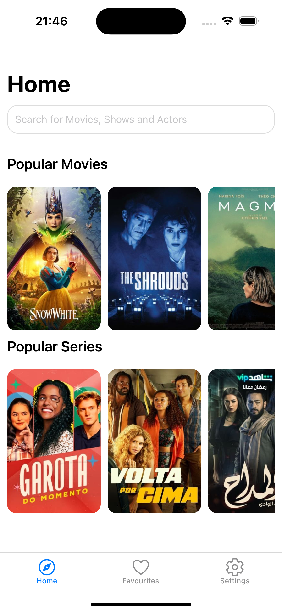
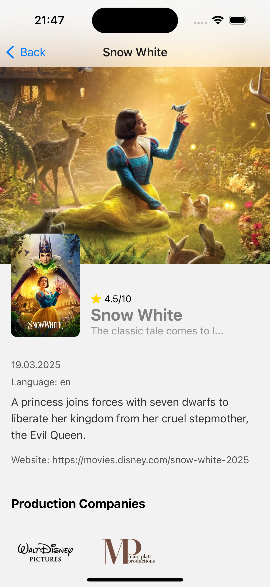
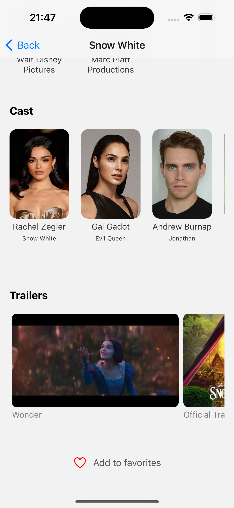

<div align="center">
    
</div>

# 🎬 Moviestash

A simple and interactive movie browsing app built with Expo. Easily search for movies, mark your favorites, watch trailers, and explore trending films.

---

## 📸 Screenshots

<div align="center">
  
  
  
</div>

---

## ✨ Features

- 🔍 **Searching** – Find movies by title, genre, or popularity.
- 📌 **Favoritizing** – Mark movies as favorites and access them easily.
- 🎞 **Watchlisting** – Save movies you plan to watch later.
- 📖 **Detail Viewing** – See full movie details, including cast, synopsis, and ratings.
- ▶️ **Trailer Watching** – Watch official movie trailers directly in the app.
- 🌟 **Trending & Recommendations** – Discover popular and top-rated films.

## 📱 Installation & Setup

1. **Clone the repository**
   ```
   git clone https://github.com/wpesicDev/moviestash
   cd moviestash
   ```

2. **Install dependencies**
   ```
   npm install
   ```

3. **Start the app**
   ```
   npm start
   ```

## 🛠️ Technologies Used

- **React Native** – Core framework for building the app.
- **Expo** – Simplifies development and testing.
- **TMDb API** – Fetches movie data (synopsis, cast, trailers, etc.).
- **Async Storage** – Saves favorites and watchlist locally.

## 🤝 Contributing

Contributions are welcome! Feel free to open issues or submit pull requests.

## 📜 License

This project is licensed under the MIT License. See the LICENSE file for details.
